# 🛡️ GCP Web Security Scanner: XSS Vulnerability Lab

## 📌 Project Overview
This project demonstrates a hands-on cloud security lab focusing on discovering and remediating **Cross-Site Scripting (XSS)** vulnerabilities. The lab involves deploying a vulnerable web application on Google Cloud Compute Engine, exploiting the vulnerability, detecting it using the native **Google Cloud Web Security Scanner**, and finally applying a code-level fix.

## 🛠️ Tools & Technologies
* **Cloud Platform:** Google Cloud Platform (GCP)
* **Compute:** GCP Compute Engine (VM)
* **Security Tool:** Web Security Scanner API
* **CLI/Access:** Cloud Shell & SSH
* **Vulnerability:** Cross-Site Scripting (XSS)

---

## 📸 Lab Implementation & Visual Evidence

### 1️⃣ Cloud Environment Setup
Provisioning the GCP environment and deploying the Compute Engine instance.

*GCP Console Project Setup:*
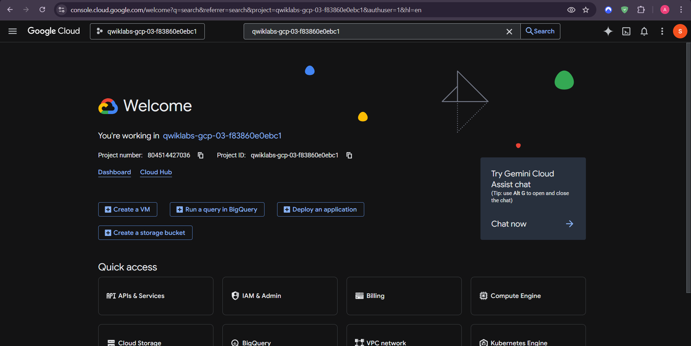

*VM Instance Successfully Created:*
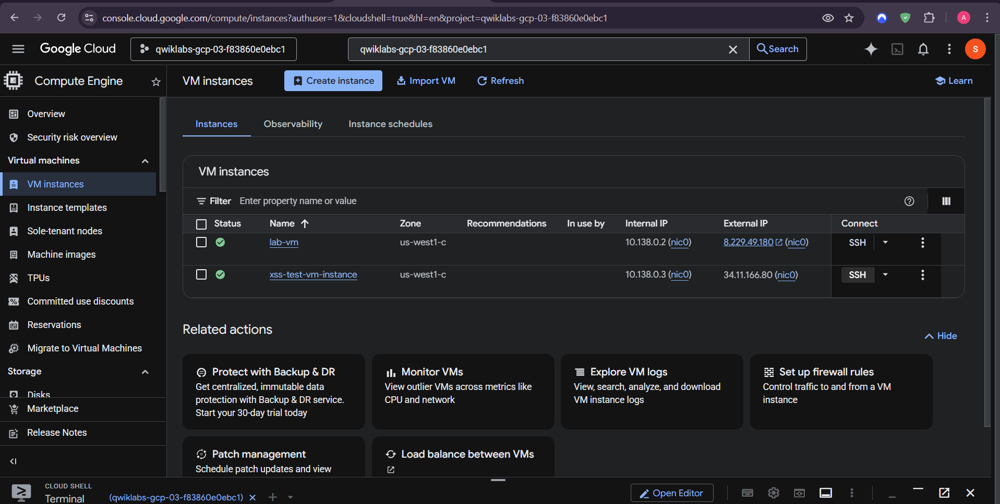

### 2️⃣ Deploying the Vulnerable Application
Using Cloud Shell and SSH to configure the server and host the application.

*Executing Cloud Shell Commands:*
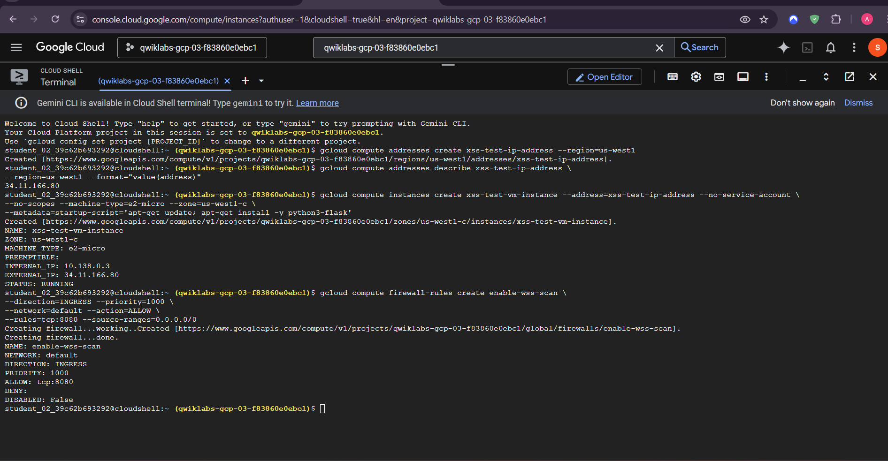

*Deploying App via SSH:*
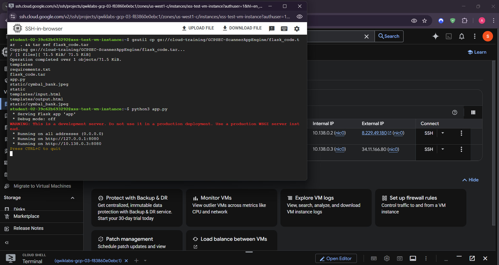

*Vulnerable Web App Running Live:*
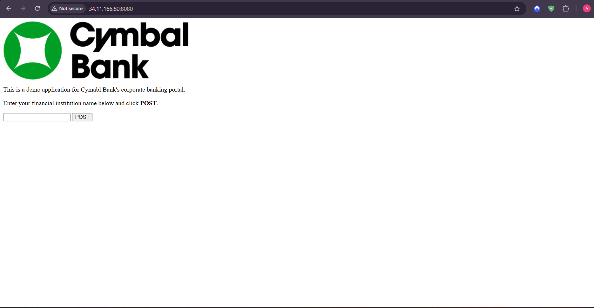

### 3️⃣ The Attack (XSS Injection)
Demonstrating the vulnerability by injecting a malicious script payload into the application.

*Active XSS Injection Demo:*
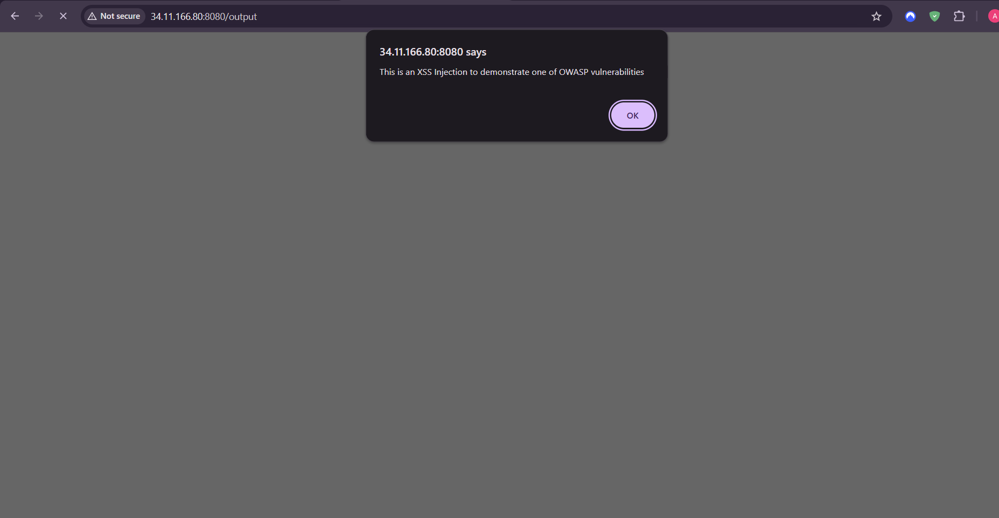

### 4️⃣ Vulnerability Detection (Web Security Scanner)
Configuring and executing the GCP Web Security Scanner to automatically detect the injected XSS flaw.

*Enabling Web Security Scanner API:*
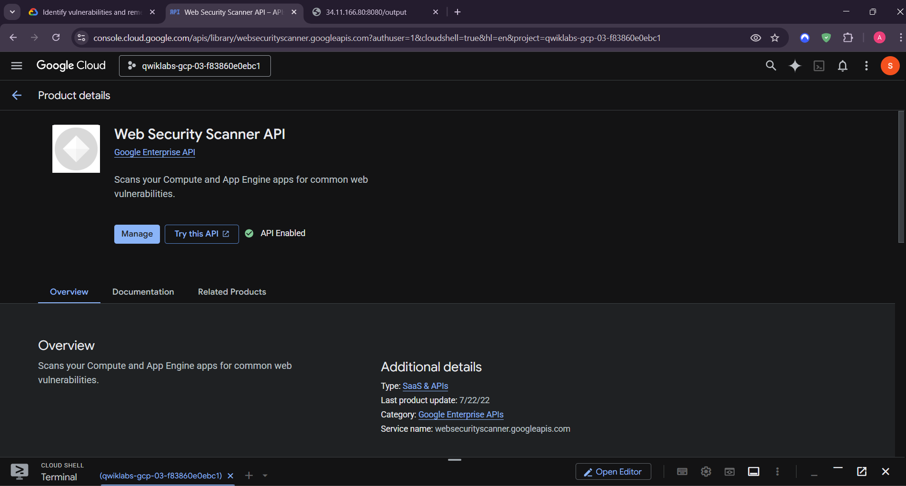

*Creating Scan Configuration:*
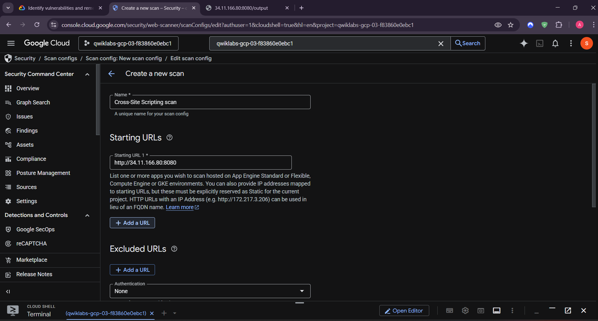

*Security Scan in Progress:*
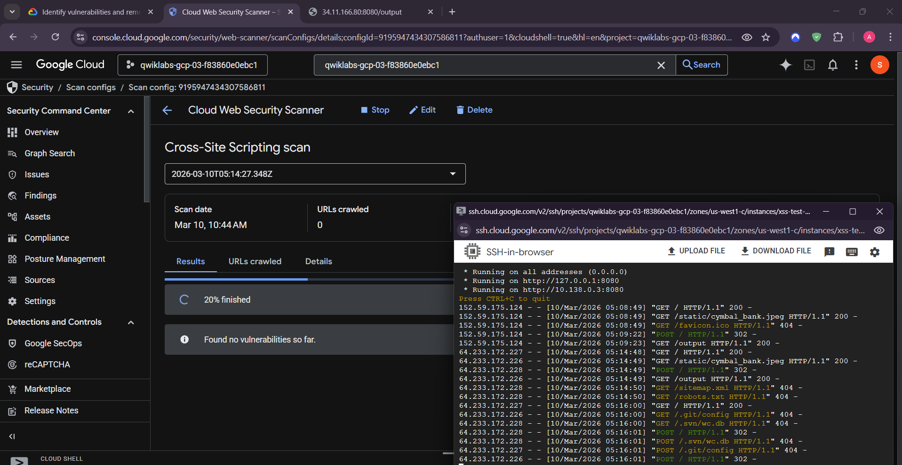

*Scanner Successfully Detects XSS Vulnerability:*
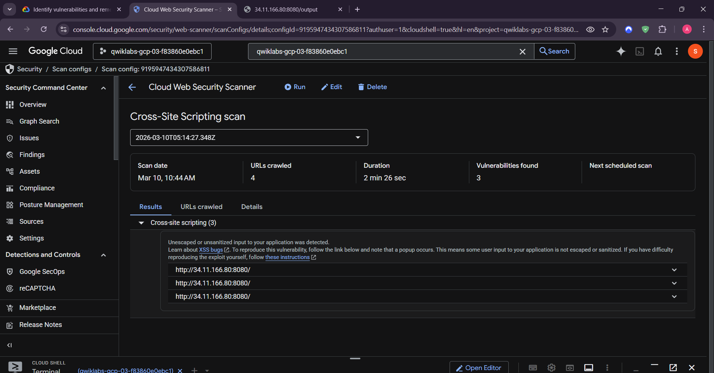

### 5️⃣ Security Remediation
Applying a security patch to the application's source code to sanitize inputs and prevent payload execution.

*Code Remediation Implemented:*
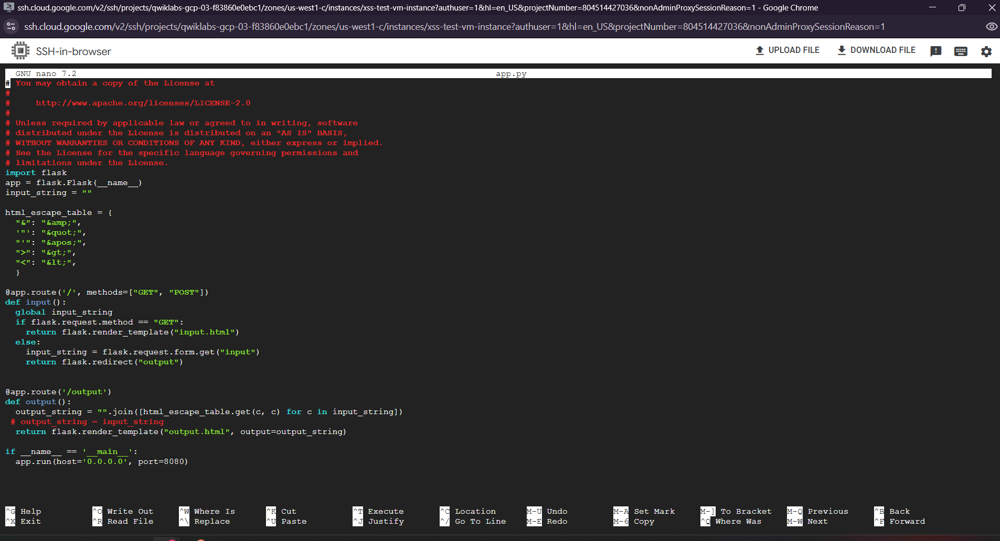

---

## ✅ Conclusion & Key Learnings
* Successfully deployed and managed infrastructure using GCP Compute Engine.
* Understood the mechanics of Cross-Site Scripting (XSS) attacks.
* Learned how to configure and leverage GCP's native **Web Security Scanner** to automate vulnerability discovery.
* Implemented secure coding practices to remediate the identified vulnerability.

---
**Author:** Ayush Kumar Patel | **Role:** Cloud Security Enthusiast
