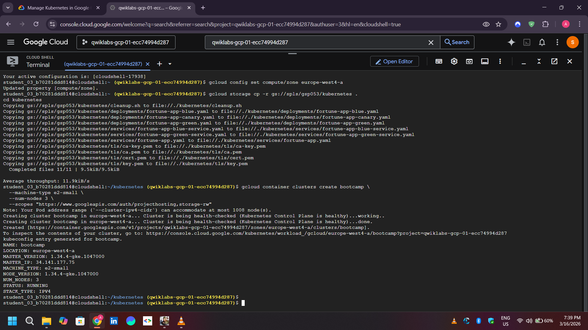
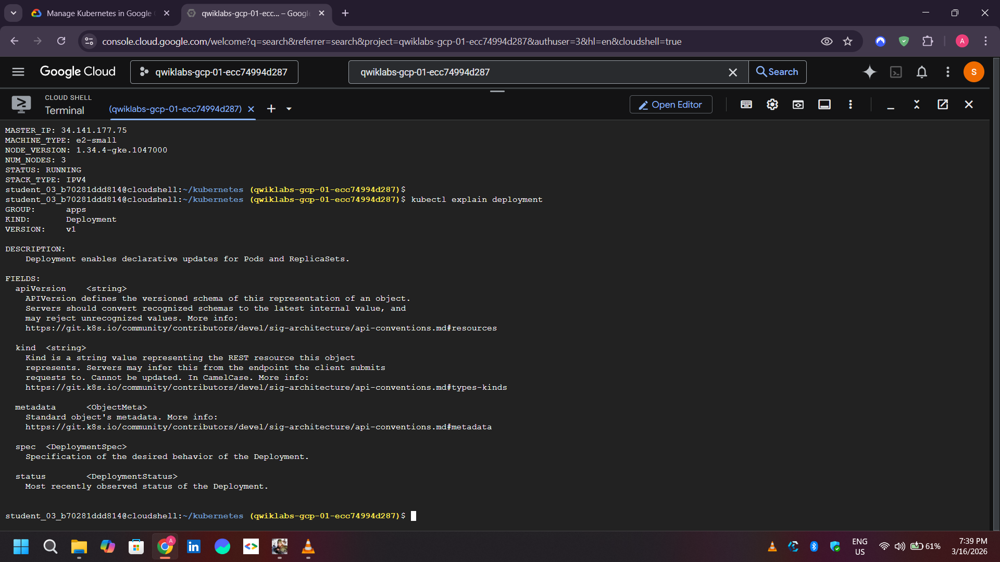
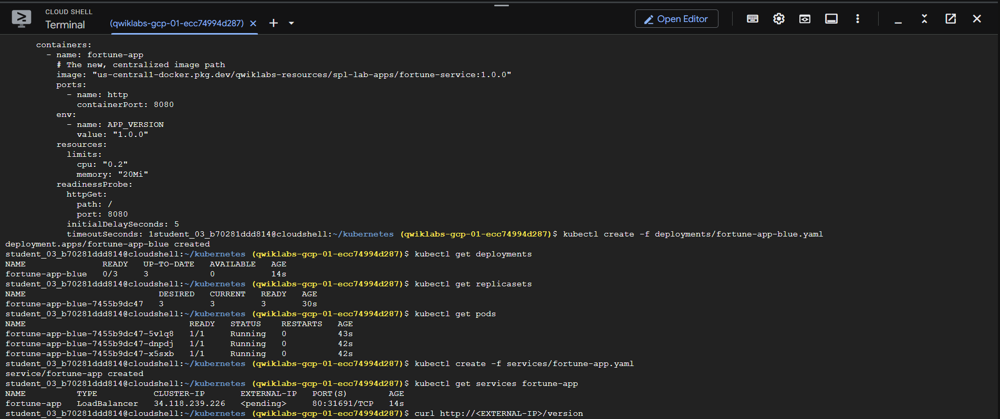
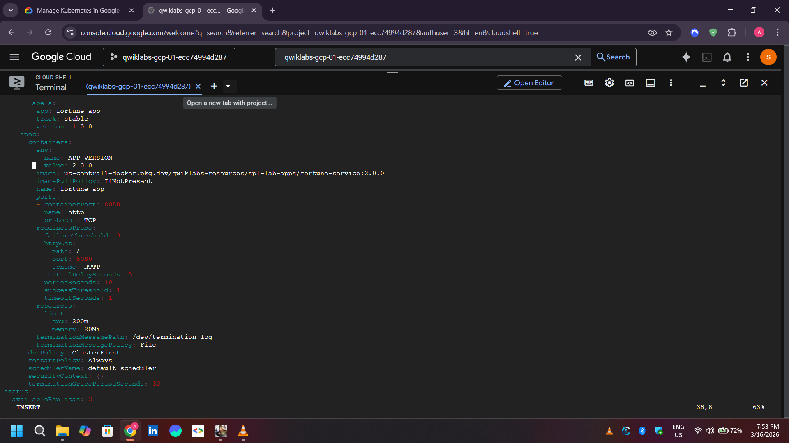
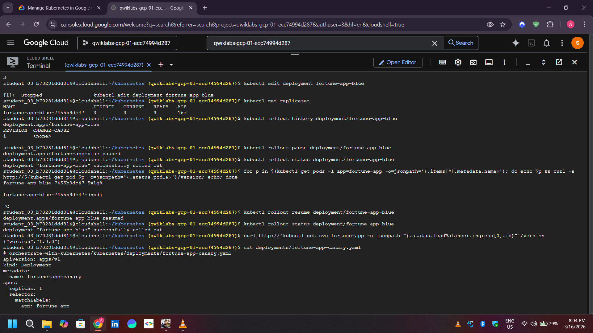
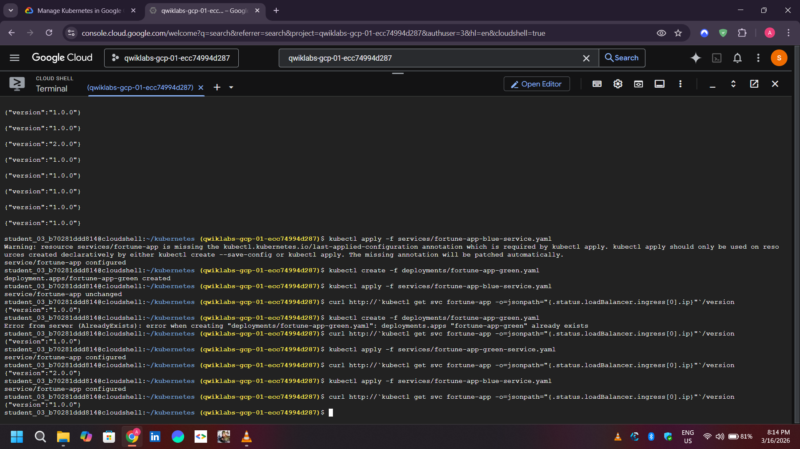

# ☸️ Managing Deployments Using Kubernetes Engine (GKE)

## 📌 Project Overview
This repository contains my progress and documentation for the Google Cloud lab: **Managing Deployments Using Kubernetes Engine**. 
In this project, I practiced various deployment strategies on Google Kubernetes Engine (GKE) to ensure high application availability, zero-downtime updates, and safe feature releases.

## 🎯 Key Skills & Concepts Practiced
* **Cluster Creation:** Provisioned a multi-node GKE cluster using `gcloud` CLI.
* **Rolling Updates:** Updated application pods from `v1` to `v2` progressively without experiencing downtime.
* **Canary Deployments:** Deployed and tested new features on a small subset of production traffic before a full rollout.
* **Blue-Green Deployments:** Routed traffic seamlessly between two identical environments (Blue and Green) for safe, instant releases and rollbacks.

---

## 📸 Lab Execution & Visual Proof of Work

### 1️⃣ Cluster Infrastructure
Successfully created a 3-node GKE cluster named `bootcamp` in the `europe-west4-a` zone.

*GKE Cluster Creation & Initialization:*


### 2️⃣ Initial Application Deployment (Blue Environment)
Deployed the initial `fortune-app-blue` (v1.0.0) application and verified the creation of Replicas and Pods.

*Deployment Details & Pods Running:*


*Blue Deployment Status Confirmed:*


### 3️⃣ Executing Deployment Strategies

**A. Rolling Updates**
Edited the deployment configuration to update the container image to `v2.0.0`. Kubernetes automatically managed the rollout by replacing old pods with new ones step-by-step.

*Rolling Update to v2 Successful:*


**B. Canary Testing**
Deployed a separate "Canary" instance alongside the main production deployment to monitor performance and user feedback on a fraction of the traffic.

*Canary Deployment Running:*


### 4️⃣ Service Traffic Management (Blue-Green)
Used Kubernetes Services (LoadBalancer) to route external traffic. Successfully practiced shifting 100% of the traffic from the Blue environment to the Green environment using label selectors.

*Traffic Switched Successfully (Blue to Green):*


---

## 🛠️ Key Commands Used

```bash
# 1. Create the GKE Cluster
gcloud container clusters create bootcamp --num-nodes 3 --zone europe-west4-a

# 2. Deploy Application
kubectl create -f deployments/fortune-app-blue.yaml
kubectl create -f services/fortune-app.yaml

# 3. Check Rollout Status
kubectl rollout status deployment/fortune-app-blue

# 4. View Deployment Metadata
kubectl explain deployment --recursive
