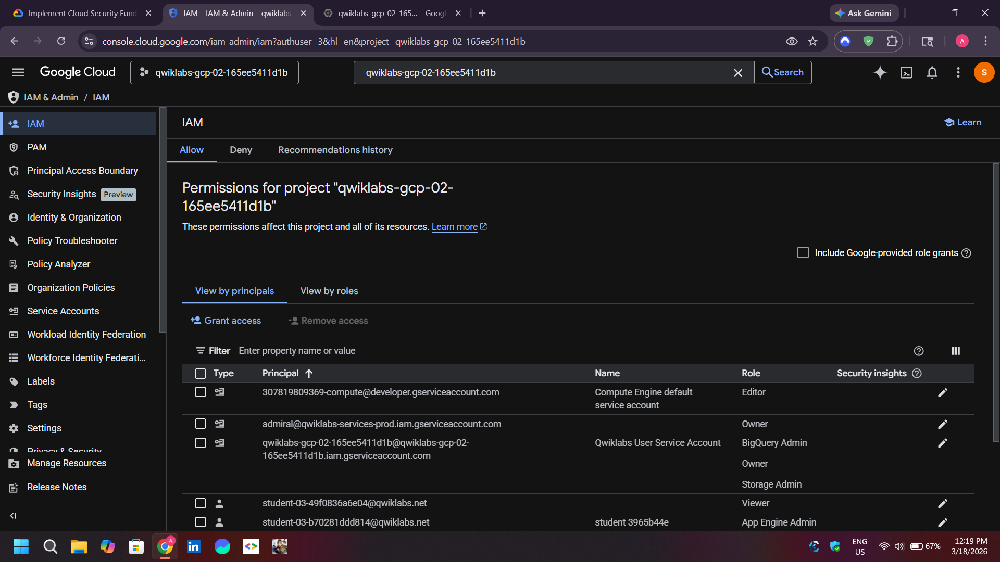
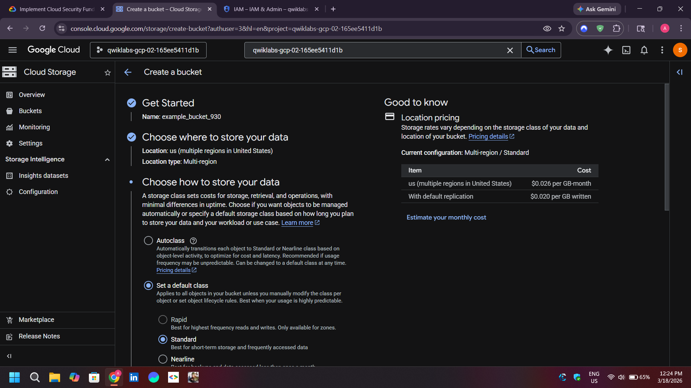
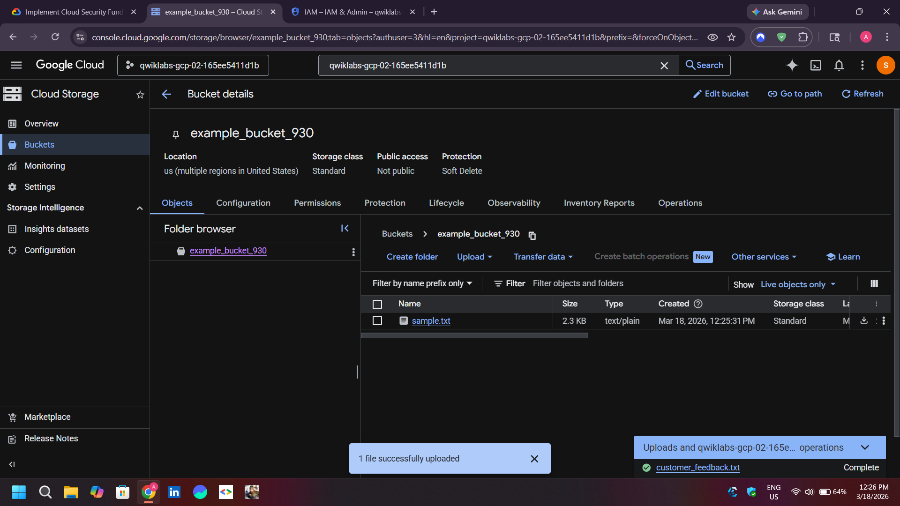
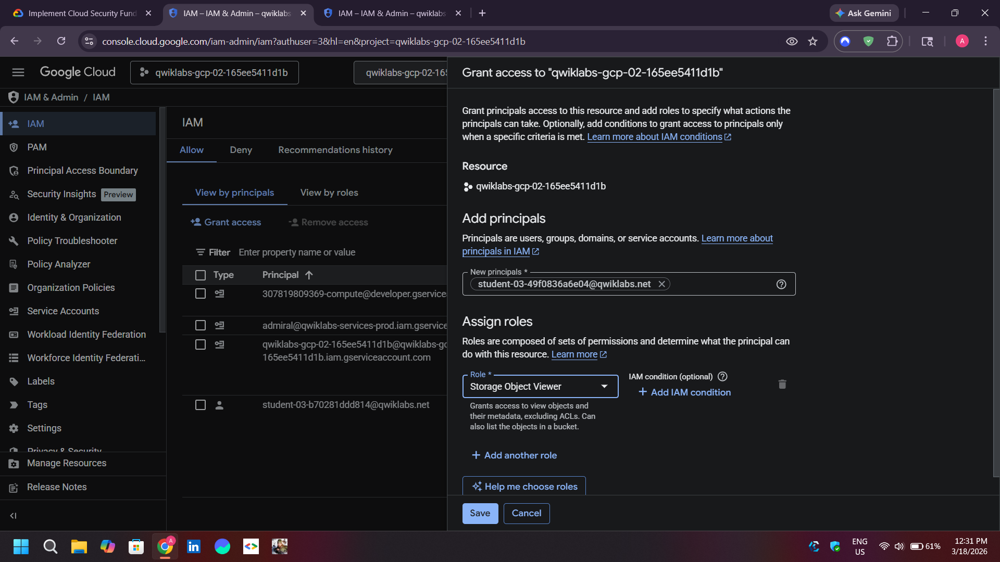

# 🔐 Google Cloud IAM: Managing Permissions and Access Control

## 📌 Project Overview
This project demonstrates the implementation of **Identity and Access Management (IAM)** within the Google Cloud Platform (GCP). The focus was on managing permissions, understanding project-level roles, and enforcing the **Principle of Least Privilege**.

## 🎯 Learning Objectives
* Assigning and revoking project-level roles (Owner, Editor, Viewer).
* Managing Cloud Storage resource permissions.
* Verifying access control through multiple user identities.
* Understanding primitive vs. predefined roles.

## 🛠️ Lab Environment Setup
The lab utilized two distinct user credentials to simulate real-world access scenarios:
1. **Username 1:** Project Owner (Full control over roles and billing).
2. **Username 2:** Project Viewer (Read-only access).

---

## 🚀 Technical Tasks & Implementation

### 1️⃣ Exploring IAM and Project Roles
Navigated the IAM console to examine the permissions of existing principals. Verified that the 'Viewer' role restricts resource modification and prevents granting further access.

*IAM Principals List:*

### 2️⃣ Cloud Storage Preparation
Created a unique Cloud Storage bucket and uploaded a sample text file (`sample.txt`) to serve as a test resource for permission verification.

*Bucket Configuration Details:*

*File Upload Success:*

### 3️⃣ Revoking Access
Removed the 'Project Viewer' role for Username 2. Verified that the access change propagated across the system, resulting in a 'Permission Denied' error when the user attempted to view resources.

### 4️⃣ Implementing Granular Access (Predefined Roles)
Instead of granting broad project-level access, I assigned the specific **Storage Object Viewer** role to the second user. This allowed the user to view objects within a specific bucket without granting access to the entire project.

*Granting Specific Storage Role:*

---

## ✅ Conclusion
This lab highlights the critical importance of IAM in cloud security. By moving from primitive roles to resource-specific predefined roles, we can significantly reduce the attack surface and ensure that users have only the access necessary for their specific tasks.

---
**Author:** Ayush Kumar Patel | **Focus:** Cloud Identity & Security
